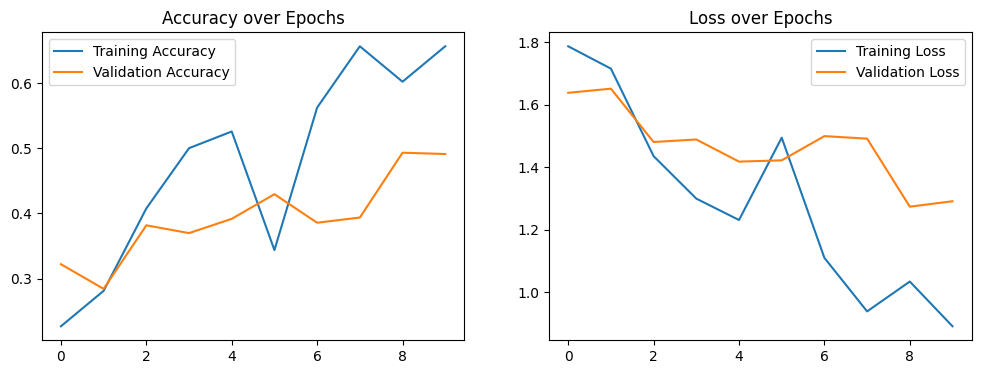
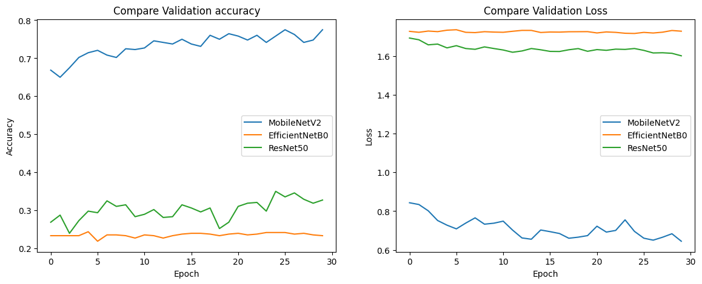

# trashnet

## Dataset
This repository contains the dataset that we collected. The dataset spans six classes: glass, paper, cardboard, plastic, metal, and trash. Currently, the dataset consists of 2527 images:
- 501 glass
- 594 paper
- 403 cardboard
- 482 plastic
- 410 metal
- 137 trash

## Installation
### Extract dataset_resized.rar
### Python setup
```bash
python -m pip install tensorflow matplotlib numpy
```

## Usage
### Step 1: Training Trashnet model and predict from trashnet.ipynb


### Step 2: Training MobileNetV2, EffcientNetB0 and ResNet50 model and predict from compare_model.ipynb

